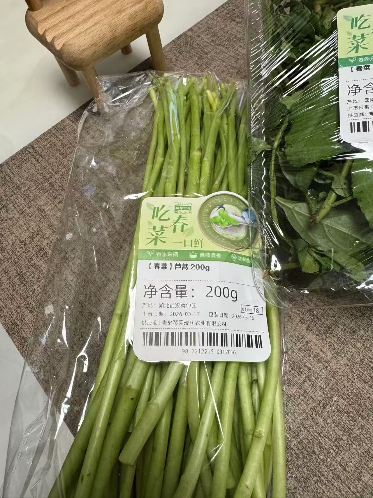
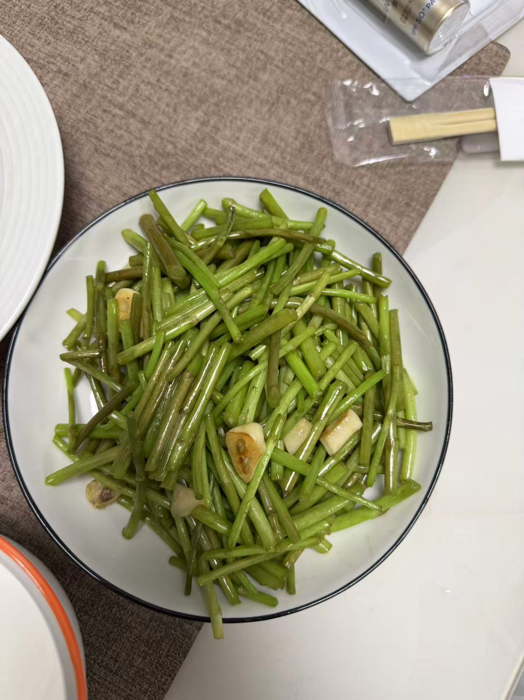
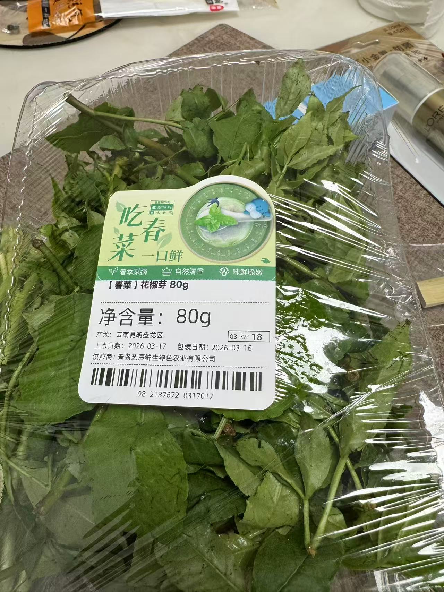
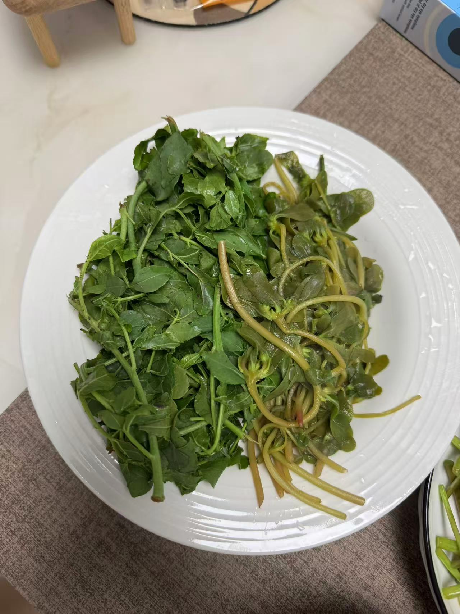
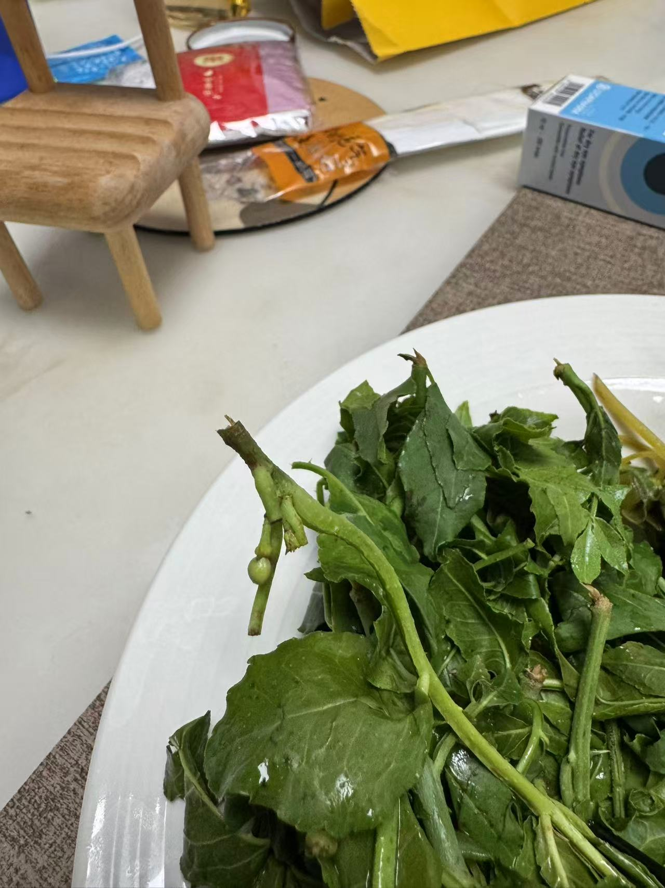
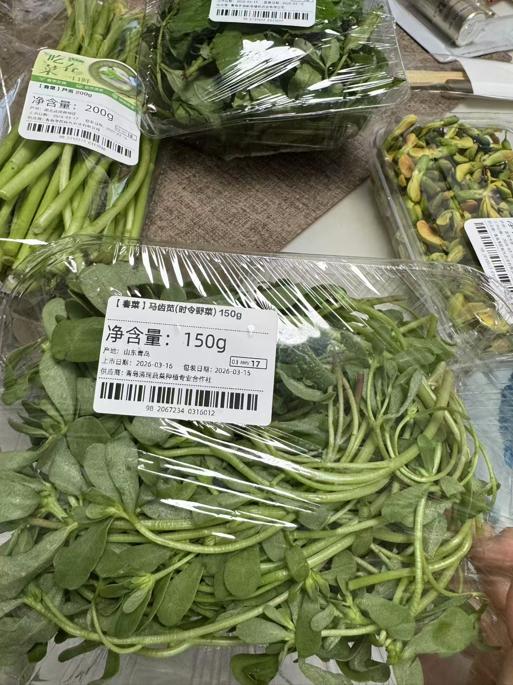
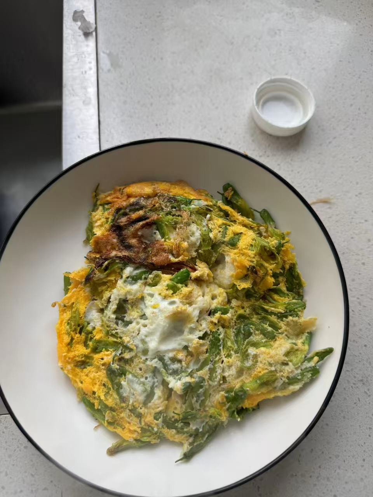
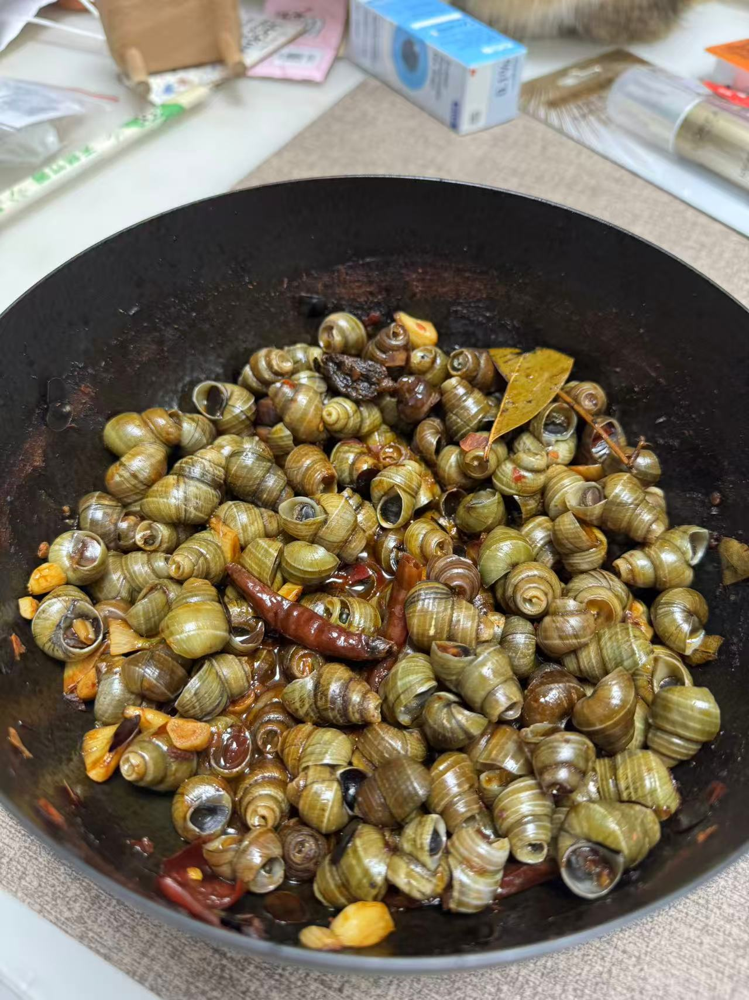

+++
date = '2026-03-17T18:30:03+08:00'
draft = false
title = '春菜'
categories = ["学习新技能"]
+++

打雷啦，下雨啦，三月啦，吃草啦！今天我们不搞什么萝卜开会，也不来什么群英荟萃，一百块钱买的了吃亏买的了上当，就给大家展示一下我都尝试了哪些春菜！

首先，上价格！有的菜折合下来一斤过百，真是春雨贵如油，春菜贵如金😶

# 芦蒿
首先第一位出场的选手是芦蒿。长得像芦笋，闻起来很像芹菜，做法是最简单的清炒，吃起来和芹菜味不太像但是也有一种特殊的香味，估计有些人会接受不了，回味有一点点清苦

# 花椒芽
下一位出场的是花椒芽，这玩意真的贵的不行，吃之前我对它是抱有很高期待的，因为花椒味我还是很喜欢的，麻油也经常吃。没想到啊没想到，真是儿子随妈，它吃起来真的就像是花椒，我甚至还看见一颗没长大的花椒！吃起来就是有花椒味的树叶子，甚至这个杆还很老！我真的怀疑卖这么贵是因为把花椒树薅秃了😶

# 马齿苋
这个名字其实见的比较多，小说里经常看见，而且价格也是这里面最便宜的，我寻思吃的人多起码说明味道大众能接受吧。结果啊结果，群众里也有坏人。这玩意是自带调味，吃起来酸酸的，而且口感有点滑滑的，接受无能。

# 金雀花
欢迎云南来的朋友!云南队上大分，煎蛋吃有清香，口感很嫩，细品还有清香！

# 螺蛳
来，跟我一起读，螺蛳（SI一声）这个虽然不是菜吧但是也是春天特产，放盐和油泡了一整天，最后感觉还是有一点腥味，也有可能是做法不太对，但是总的来说还行，调料啥味就啥味。

