+++
date = '2026-03-09T20:30:18+08:00'
draft = false
title = '淮安'
categories = ["hello-world"]
+++

### 引言
淮安之旅很开心，江南生活感觉很安逸，各种园林美景超级好看，本篇先介绍淮安的吃吃喝喝。在吃第一顿饭时因为什么都想吃点多了，还邀请旁边桌小哥哥一起吃了。
#### 第一章
烫干丝，干丝不是豆腐皮那种口感，而是很嫩很滑的那种，调味就是酱油香，酱油味有
点太重

平桥豆腐，像是一道羹，里面有豆腐，一点点蛋皮，肉分辨不出来，喝起来口感不错
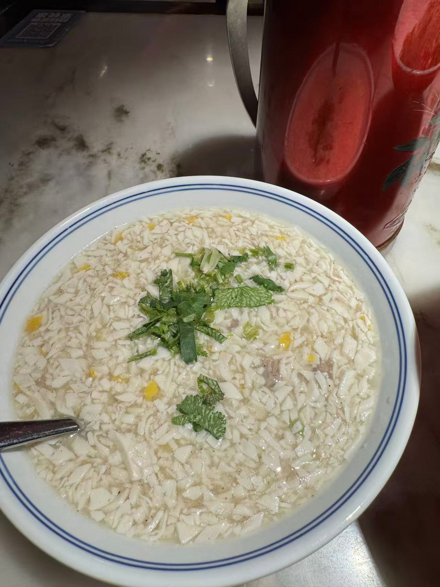

猪油渣娃娃菜,猪油渣和花脂渣味道差不多,不脆
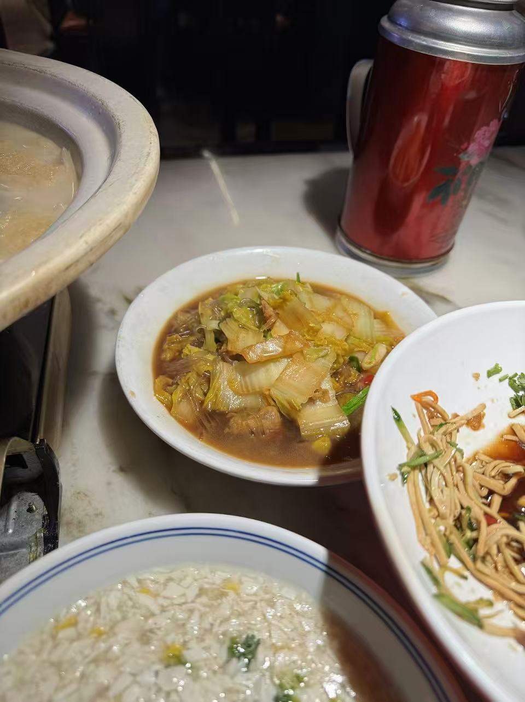

老淮安头道菜，有丸子，豆腐，蔬菜好像还有点海鲜，喝起来还行，里面猪皮挺好吃
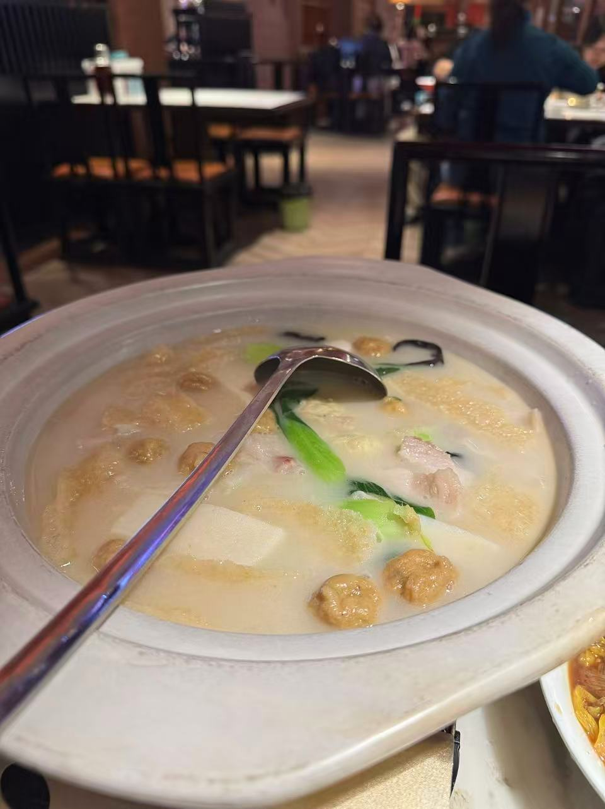

小脚卷，没有馅，奶香味的，很好吃

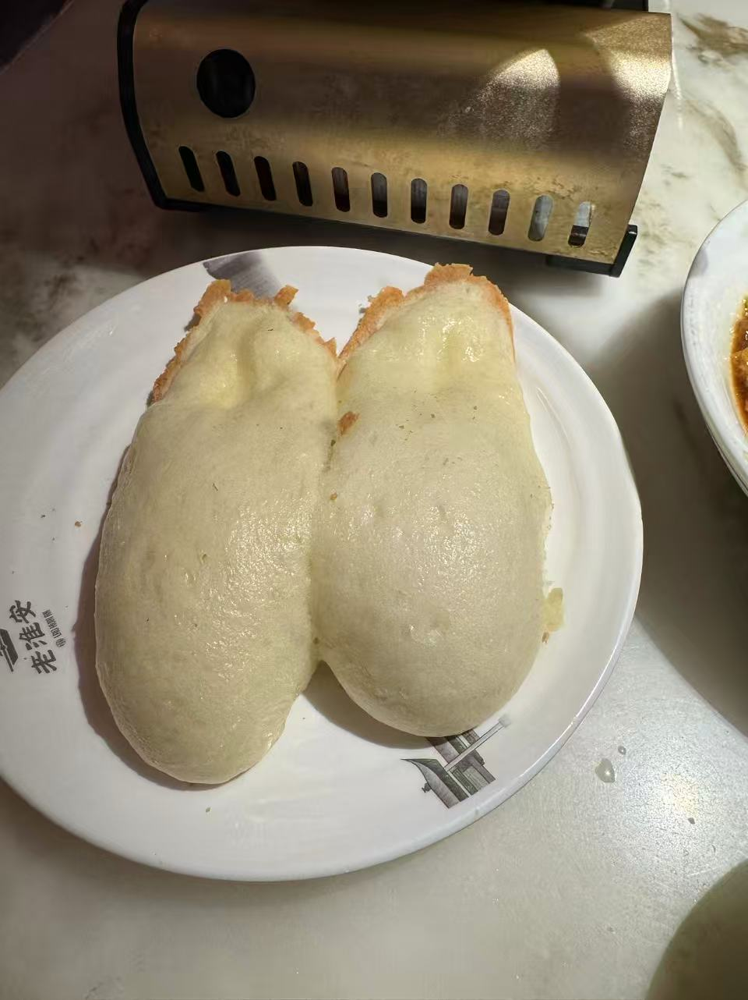

炸串就是正常炸串，带甜口，臭干子像是豆腐外面加了脆皮，配的酱有点像是甜面酱，十三香小龙虾就是正常口味，感觉跟平时吃的差不多
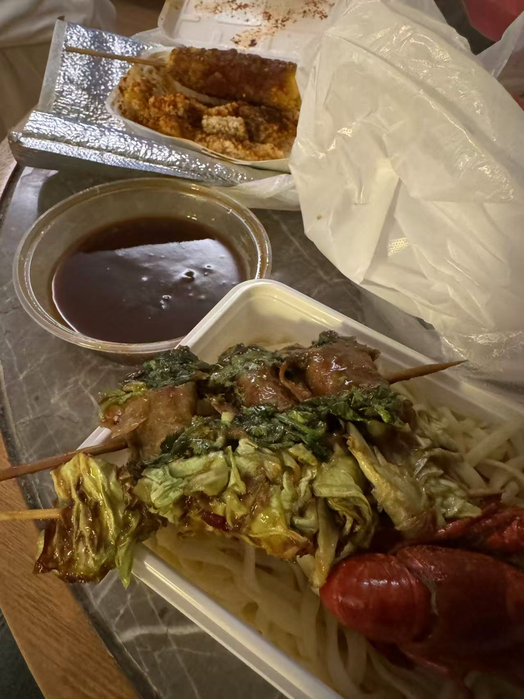
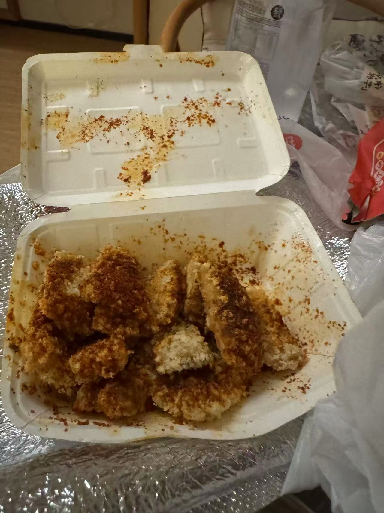
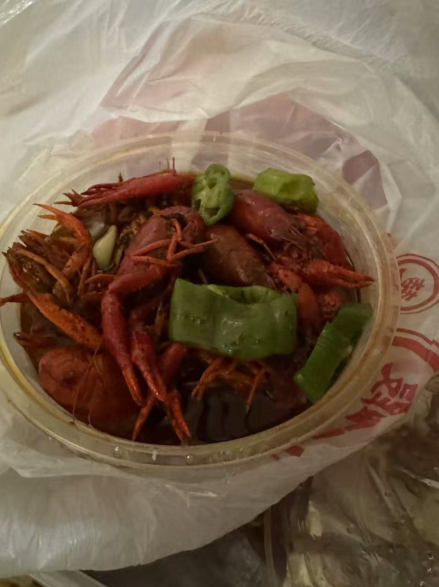

长鱼面加了蹄髈，我以为江南的面走的都是清汤寡水的路线，实际上滋味很足，浇头都是现炒，长鱼没有奇怪味道，肉质很滑嫩，表面有种勾芡得黏糊感，汤底咸鲜
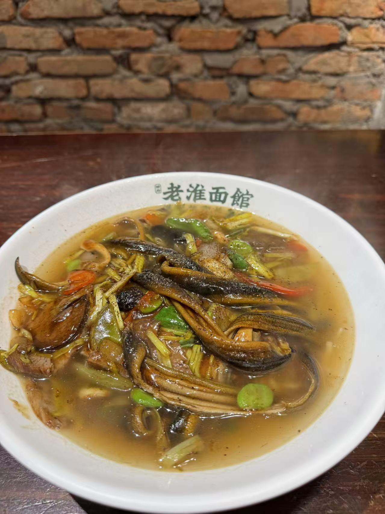

这个雾鲜的奶茶很好喝，不怎么甜，开心果味也很好
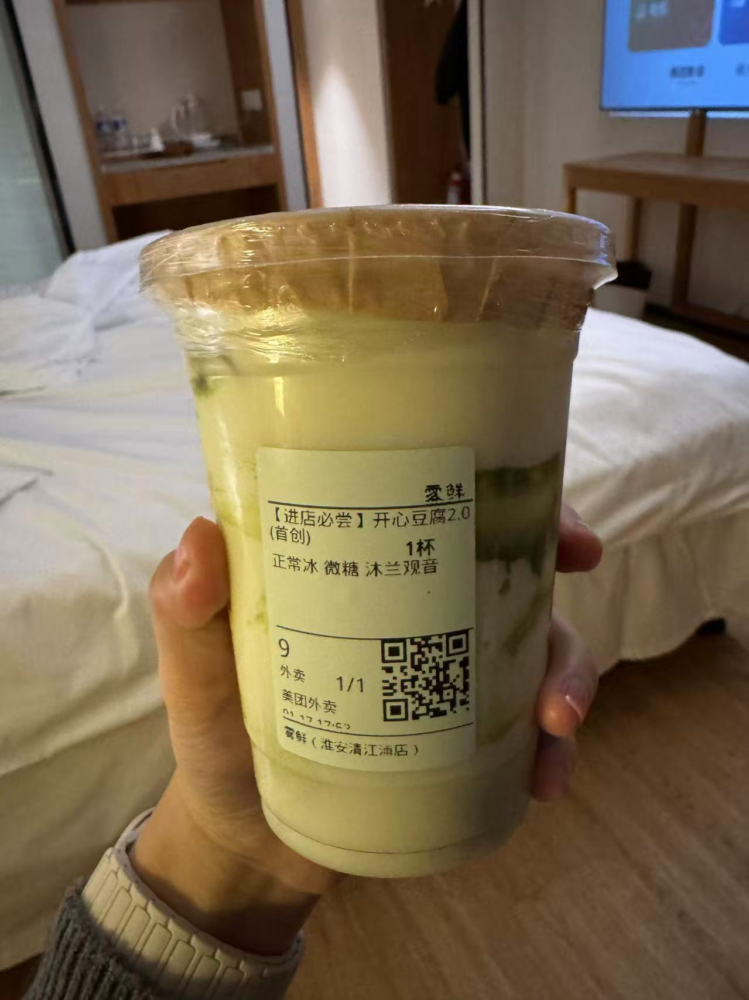

bola奶茶，这个蛋糕就是非常正常的蛋糕奶茶，没有什么特别，但是芭乐奶绿非常好喝，罢了得特殊风味喝奶融合的非常好，一点也不涩，就是籽有点多

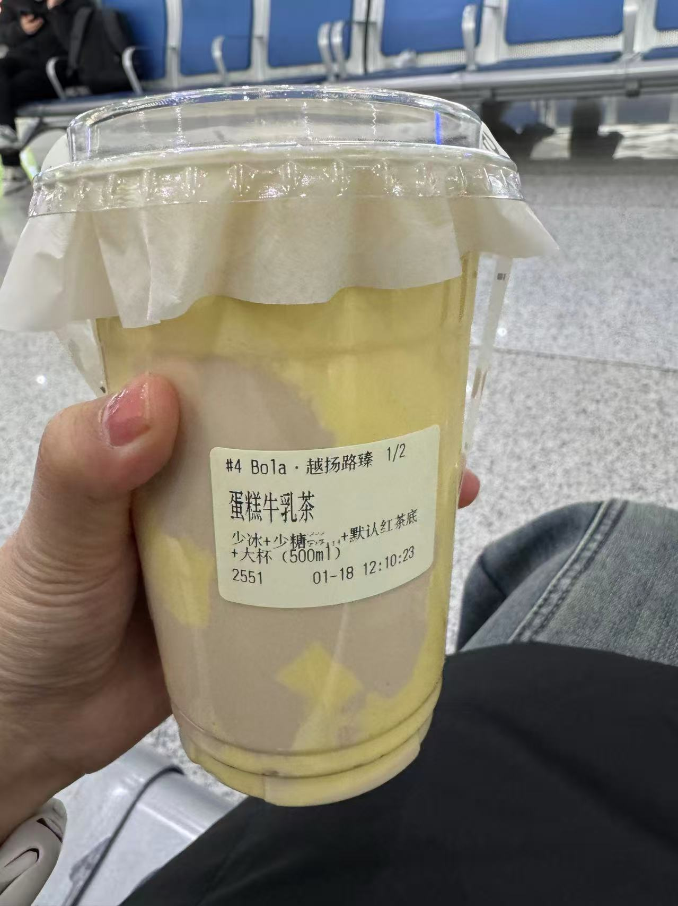

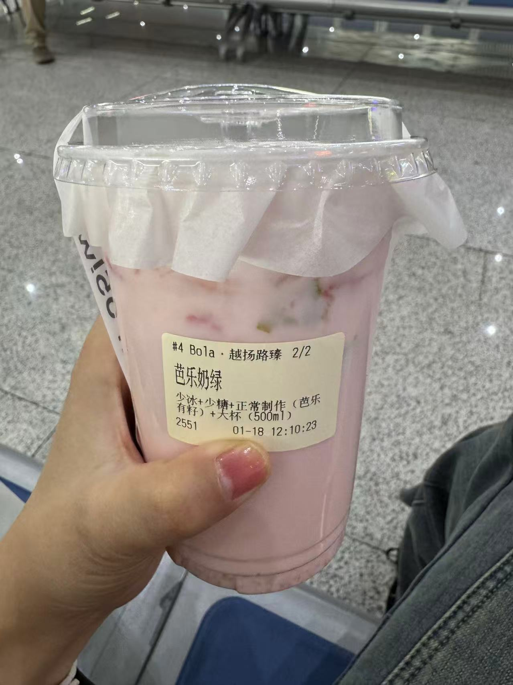
